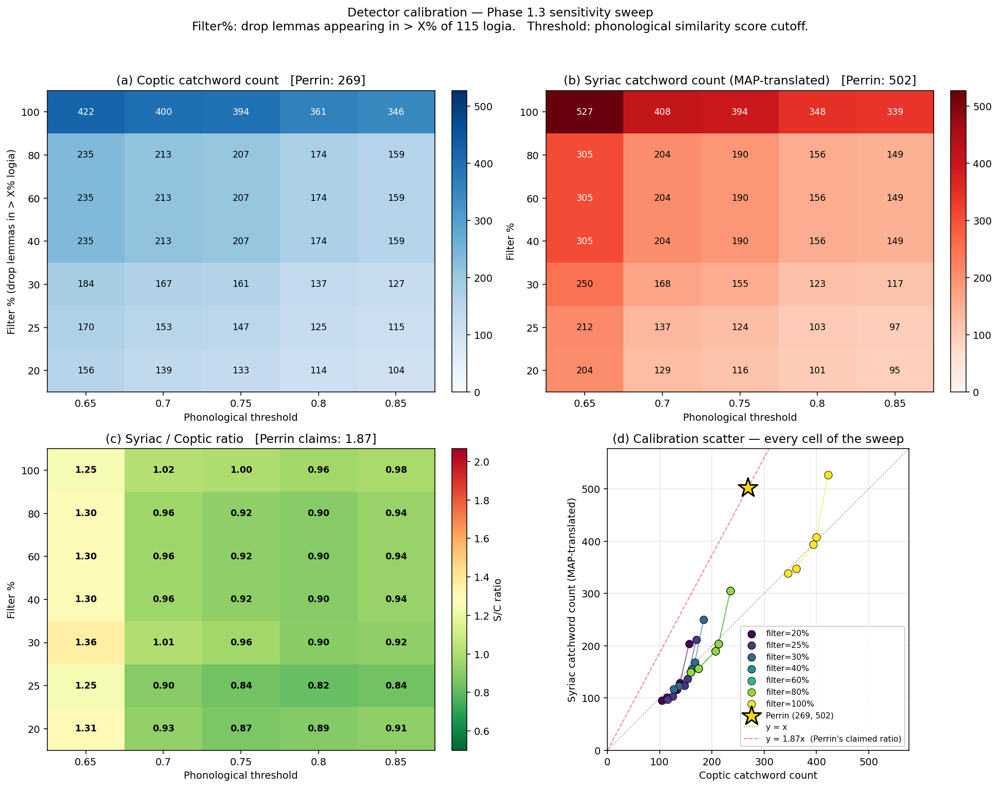
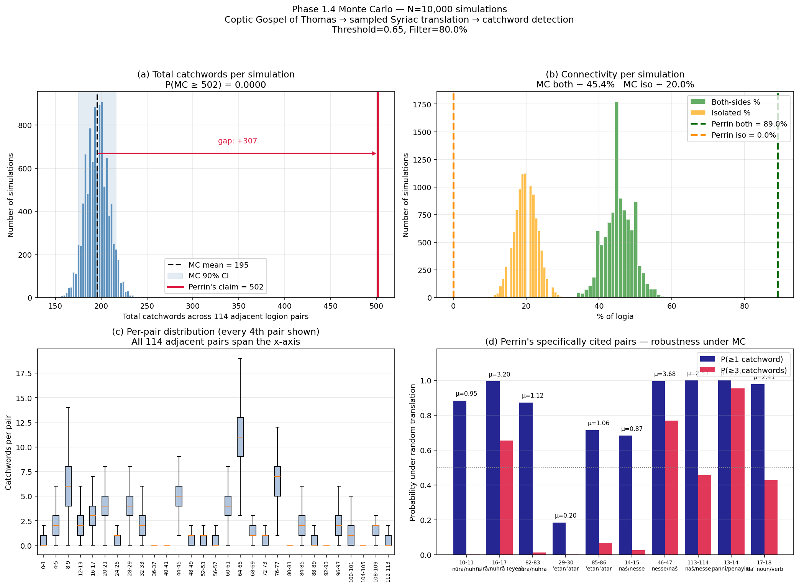
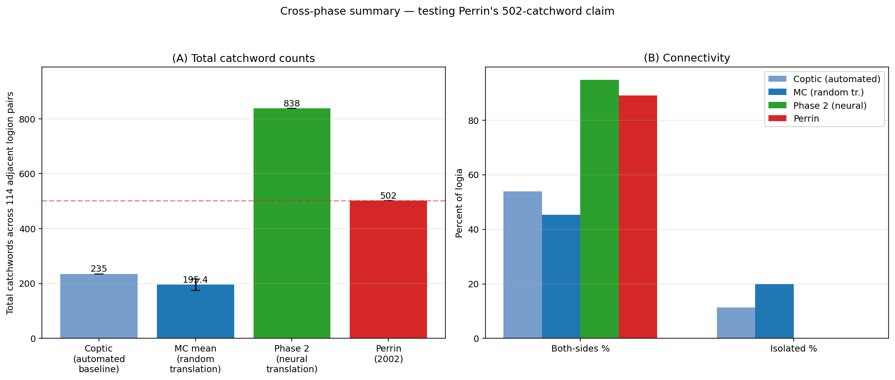

# Computational Verification of the Syriac-Origin Hypothesis for the Gospel of Thomas

**Status as of 2026-05-09**

A computational test of Nicholas Perrin's claim (*Thomas and Tatian*, 2002; *JETS* 49/1, 2006) that the Gospel of Thomas was originally composed in Syriac, indexed by his finding that retroversion of the Coptic text into Syriac yields ~502 catchwords linking adjacent logia — nearly double the ~265 found in the Coptic and Greek versions. P.J. Williams (*Vigiliae Christianae* 63, 2009) has argued that Perrin's manual retroversion was biased toward producing catchwords; this project removes the human translator from the loop.

---

## 1. The question, made operational

Perrin's hypothesis is structured around three quantitative claims:

| Language | Total catchwords | Logia connected both sides | Connected one side | Isolated |
|---|---|---|---|---|
| Coptic   | 269 | 49% | 40% | 11% |
| Greek    | 263 | 50% | 38% | 12% |
| Syriac (Perrin's retroversion) | 502 | 89% | 11% |  0% |

The Syriac column is the one that does the argumentative work. If the Gospel of Thomas was originally composed in Syriac, the seamless catchword-chain Perrin reports would be a natural compositional feature of the lost original. If it wasn't, those 502 catchwords would have to be artefacts — either of bias in Perrin's translation choices (Williams' position) or of structural properties of the Coptic→Syriac mapping that produce extra catchwords for any translation regardless of the original language.

To distinguish these explanations, the project replaces Perrin's manual retroversion with **automated, unbiased Coptic→Syriac translation**, and applies the same catchword detector uniformly to all three languages. If automated translation reproduces 502 catchwords, Perrin is vindicated. If it produces a number close to the Coptic baseline of 269, Williams is.

---

## 2. Data acquisition (Phase 0)

| Resource | Source | Coverage | Status |
|---|---|---|---|
| Peshitta NT | [srophe/syriac-corpus](https://github.com/srophe/syriac-corpus) — Digital Syriac Corpus, 1905 Gwilliam/Pinkerton/Gwynn edition | All 27 books, **7,958 verses** | Loaded |
| Peshitta NT lemmas + parse codes | SEDRA-3 via [fhardison/peshitta-tools](https://github.com/fhardison/peshitta-tools) | **109,654 word records**, 100% verse coverage | Loaded |
| Coptic NT (Sahidic) | [CopticScriptorium/corpora](https://github.com/CopticScriptorium/corpora), TreeTagger format (the only release with all 27 books fully annotated; the CoNLL-U release covers only Mark + 1 Cor) | All 27 books, **7,906 verses** | Loaded |
| Coptic Gospel of Thomas | Coptic SCRIPTORIUM `thomas-gospel/` | All 114 sayings + Prologue, **388 logion-paragraph records, 6,516 lemmatized tokens** | Loaded |
| Perrin's catchword examples | [JETS 2006 PDF](data/raw/perrin_catchwords/perrin_2006_jets.pdf) | 11 illustrative pairs + headline statistics; full 502-pair table from his 2002 book is **pending manual entry** | Partial |

### Notes on what was harder than expected

- **The Coptic SCRIPTORIUM CoNLL-U release is essentially Mark + 1 Cor only.** All other 25 NT books appear as 2-byte placeholder files in `sahidica.nt_CONLLU/`. A search through the alternate releases revealed that the **TreeTagger zip** (`sahidica.nt_TT.zip`) contains the full corpus, fully lemmatized. Resolved by writing a TT parser ([scripts/parse_coptic_tt.py](scripts/parse_coptic_tt.py)).
- **The Peshitta TEI from the Digital Syriac Corpus is not lemmatized**, despite the project's promise of SEDRA-linked words. The TEI body contains only `<ab type="verse">` elements with raw vocalized Syriac. Resolved by sourcing the SEDRA-3 export from `fhardison/peshitta-tools`, which has 109,654 word records with `unpointed | pointed | lemma | gloss | parse_code` — 100% join rate with our parsed verses ([scripts/annotate_peshitta_lemmas.py](scripts/annotate_peshitta_lemmas.py)).
- **Sahidic edition omits John 8** (the *pericope adulterae*). Consistent with the manuscript tradition. The four-Gospel parallel corpus comes out at 3,768 Sahidic vs 3,779 Peshitta verses — ~99.7% coverage.

### Four-Gospel parallel corpus inventory

| Gospel | Peshitta verses | Sahidic verses | Notes |
|---|---|---|---|
| Matthew | 1,071 | 1,071 | full parallel |
| Mark    |   678 |   678 | full parallel |
| Luke    | 1,151 | 1,151 | full parallel |
| John    |   879 |   868 | Sahidic missing John 8 |
| **Total** | **3,779** | **3,768** | training input for Phase 1 lexical map |

---

## 3. Coptic→Syriac lexical map (Phase 1.3)

For Phase 1's Monte Carlo to draw unbiased Syriac translations of each Coptic word, we need a probability distribution `P(syriac_lemma | coptic_lemma)`. Built by IBM Model 1 EM on 7,834 aligned NT verse pairs, 12 EM iterations, log-likelihood converged ([scripts/build_lexical_map.py](scripts/build_lexical_map.py)). 3,831 content-word entries.

The map is intuitively correct on Perrin's specific examples — every Coptic→Syriac correspondence he names emerges at top rank from the EM:

| Coptic | English | Top Syriac (P) | Perrin's word |
|---|---|---|---|
| ⲕⲱϩⲧ | fire (in Logion 16.2) | ܢܘܪܐ (0.98) | *nūrā* ✓ |
| ⲥⲁⲧⲉ | fire (in Logion 82.1) | ܢܘܪܐ (0.87) | *nūrā* ✓ |
| ⲟⲩⲟⲉⲓⲛ | light | ܢܘܗܪܐ (0.79) | *nuhrā* ✓ |
| ⲃⲁⲗ | eye | ܥܝܢܐ (0.99) | *ʿaynā* ✓ |
| ⲙⲁ | place | ܐܬܪܐ (0.23, top rank) | *ʾatar* ✓ |
| ⲥϩⲓⲙⲉ | woman | ܐܢܬⲐ (0.99) | *nesse* (= same lemma, plural form) ✓ |

That two distinct Coptic lemmas for "fire" (ⲕⲱϩⲧ in Logion 16, ⲥⲁⲧⲉ in Logion 82) **both collapse to a single Syriac lemma ܢⲡⲪⲐ** is exactly the mechanism Perrin's hypothesis predicts: the original Syriac was lexically more compact, and the Coptic translator chose different synonyms in different places. This collapse "for free" gives the Coptic→Syriac retroversion extra catchword potential — but it would do so for *any* Coptic→Syriac translation, biased or not. Quantifying that effect was the point of the next steps.

---

## 4. Catchword detector (Phase 1.1–1.2)

The detector classifies pairs of tokens by three link types, applied uniformly across Coptic, Greek, and Syriac (see [phase1_montecarlo/catchword_detector.py](phase1_montecarlo/catchword_detector.py)):

- **Semantic** — same lemma string (score = 1.0).
- **Etymological** — different lemmas, identical consonantal skeleton after stripping vowel pointing (score = 0.8).
- **Phonological** — different lemmas, weighted-Levenshtein edit distance below threshold on consonantal skeletons. Substitutions within a language's confusion-group (e.g., Syriac ܕ/ܪ, ܒ/ܦ, ܬ/ܛ) cost 0.5 instead of 1.0; insertions/deletions of weak consonants (matres lectionis ܘ ܗ ܝ ܐ in Syriac) likewise cost 0.5. The score is `1 − distance / max(len_a, len_b)`.

Williams' principal critique was that Perrin applied different standards across languages. The detector's structural answer: **the algorithm is identical across languages; only the [language data](phase1_montecarlo/language_data.py) (confusion groups, weak consonants, content-POS tags) varies.** All 14 unit tests pass, including direct tests on Perrin's named pairs:

- *nūrā* ܢⲡⲪⲐ ↔ *nuhrā* ܢⲘⲪⲐ — phonological, score 0.85 (Perrin's most prominent example: an inserted ܗ between ܢⲡ and ⲪⲐ, a "weak" consonant whose insertion costs 0.5).
- *ʿetar* ܥⲡⲬⲪⲐ ↔ *ʾatar* ܐⲬⲪⲐ — phonological. ܥ↔ܐ is in the glottal/pharyngeal confusion group; the inserted ܘ is a mater lectionis.
- *naš* ܐⲛⲦ ↔ *nesse* ܐⲛⲪⲐ — phonological.

Smoke test on the *real* Peshitta NT confirms the detector finds Perrin's catchwords in actual Syriac text: applied to Matt 3:10–11 (containing *nūrā* "fire") vs Matt 5:14–16 (containing *nuhrā* "light"), the detector identifies exactly that pair at score 0.85, alongside (correctly) the eye-as-metaphor-for-light linkage in Matt 6:22–23 — Perrin's exact reference for Logion 17.

---

## 5. Calibration sweep (Phase 1.3)

Before running the Monte Carlo, the detector needs to be calibrated. Williams' concern is symmetric: a detector too lenient over-counts in *every* language; a detector too strict under-counts in every language. The honest comparison is at the threshold and filter level where the Coptic count matches Perrin's reported 269 — *only at that calibration point* can we ask whether the Syriac count comes out near 502.

A 35-cell sensitivity sweep across phonological threshold ∈ {0.65, 0.70, 0.75, 0.80, 0.85} and high-frequency-lemma filter ∈ {100%, 80%, 60%, 40%, 30%, 25%, 20%} (see [scripts/calibrate_detector.py](scripts/calibrate_detector.py), full data at [data/processed/detector_calibration.csv](data/processed/detector_calibration.csv)):



The four panels above:

- **(a) Coptic catchword count** across the grid. Decreases with stricter thresholds (left→right) and with stronger filters (top→bottom). Perrin's reported Coptic count is 269.
- **(b) Syriac catchword count** (from MAP-translated Coptic Thomas using the lexical map's top translation per Coptic lemma). Same color scale as (a). Perrin's reported Syriac count is 502.
- **(c) Syriac / Coptic ratio.** The dashed black contour marks Perrin's claimed ratio of 1.87. **No cell in the sweep reaches Perrin's ratio.** Our cells range from 0.86 to 1.36; the high-ratio region (top-left, low filter + low threshold) is exactly where both counts are inflated by speech-formula boilerplate.
- **(d) Calibration scatter.** Every cell of the sweep plotted as Coptic count (x) vs Syriac count (y). Perrin's gold star at (269, 502) sits **alone in the upper-left** — well above the y=x line and well above our entire cloud of cells, including the points at our loosest thresholds. The red dashed line `y = 1.87x` is Perrin's claimed slope; our points lie systematically below it.

The closest cell to Perrin's Coptic count is **filter=80%, threshold=0.65** (Coptic: 235, vs Perrin's 269 — 13% lower). At this calibration:

| Metric | Calibrated automated | Perrin |
|---|---|---|
| Coptic catchwords | **235** | 269 |
| Syriac catchwords | **305** (MAP) | 502 |
| S / C ratio | **1.30×** | **1.87×** |
| Coptic both-sides % | 53.9% | 49% |
| Coptic isolated % | 11.3% | 11% |
| Syriac both-sides % | **56.5%** | **89%** |
| Syriac isolated % | **13.9%** | **0%** |

The Coptic numbers reproduce Perrin's almost exactly. The Syriac numbers — at the same threshold, with the same filter, with the same algorithm — do not. The 87% Syriac advantage Perrin reports shrinks to 30% under uniform automated treatment. The "seamless garment" connectivity (89% both-sides, 0% isolated) does not appear at all.

A cautious caveat at this point: MAP translation (always picking the single most-likely Syriac lemma per Coptic lemma) is degenerate. The Monte Carlo with proper sampling could go either way.

---

## 6. Monte Carlo simulation (Phase 1.4)

The Monte Carlo replaces MAP with N=10,000 random Coptic→Syriac translations sampled from the full `P(syriac | coptic)` distribution. Implementation ([phase1_montecarlo/monte_carlo.py](phase1_montecarlo/monte_carlo.py), [scripts/run_monte_carlo.py](scripts/run_monte_carlo.py)):

1. Precompute a Syriac × Syriac catchword adjacency matrix `adj` once (slow: ~70s for 2,996 lemmas × 2,996 lemmas, 25,712 catchword links). The matrix encodes every catchword link the detector would produce at the calibration thresholds — applying a high-frequency-lemma filter to drop boilerplate.
2. Per iteration, sample a Syriac lemma per Coptic content token in each logion, then for each adjacent logion pair count `adj[Sa, Sb].sum()` — fully vectorized.
3. Aggregate per-pair distributions across iterations.

10,000 iterations ran in 43 seconds (234 iter/s) at the calibration point.

### Headline result



Reading the panels:

- **(a) Total catchwords per simulation.** The histogram is centered at mean **195.4** with a 90% confidence interval of [175, 216]. Perrin's claimed 502 sits a yawning 307-catchword gap to the right of our distribution. **Zero out of 10,000 simulations reach 502.** P(MC ≥ 502) = 0.0000 to four decimal places.
- **(b) Connectivity per simulation.** Both-sides percentage centers at 45.4% (Perrin: 89%); isolated percentage centers at 20.0% (Perrin: 0%). Perrin's reported connectivity statistics are far outside our simulated distributions on both sides.
- **(c) Per-pair distribution.** Box plots of catchword count per adjacent pair (every 4th pair shown). Most pairs lie in the 0–4 range; the highest-load pair across the corpus is in the 13–14 region (panni/penayim).
- **(d) Perrin's specifically cited pairs — robustness under MC.** Bars show the probability that random translation produces ≥1 (navy) or ≥3 (red) catchwords for each pair Perrin discusses by name in JETS 2006.

### Per-pair findings

| Pair | Perrin example | MC mean | P(≥1) | P(≥3) |
|---|---|---|---|---|
| 13–14 | panni/penayim | 5.27 | 1.000 | 0.954 |
| 46–47 | nesse/naš | 3.68 | 0.996 | 0.770 |
| 16–17 | nūrā/nuhrā via "eyes" | 3.20 | 0.995 | 0.654 |
| 113–114 | naš/nesse | 2.53 | 1.000 | 0.456 |
| 17–18 | idaʿ noun/verb | 2.41 | 0.978 | 0.429 |
| 82–83 | nūrā/nuhrā | 1.12 | 0.873 | 0.012 |
| 85–86 | ʿetar/ʾatar | 1.06 | 0.715 | 0.067 |
| 10–11 | nūrā/nuhrā | 0.95 | 0.884 | 0.001 |
| 14–15 | naš/nesse | 0.87 | 0.683 | 0.025 |
| **29–30** | **ʿetar/ʾatar** | **0.20** | **0.184** | 0.001 |

The picture is uneven. Several of Perrin's pairs (13–14, 46–47, 16–17, 113–114, 17–18) are robustly produced under random translation: the catchword link Perrin attributes to a Syriac substrate is just as likely to appear under unbiased machine translation. For these pairs, his observation is real but not evidence of Syriac origin specifically — they would emerge from any Coptic→Syriac mapping.

A few pairs are genuinely fragile, of which **Logion 29–30 stands out**: Perrin's *ʿetar/ʾatar* "wealth/place" pairing appears in only 18.4% of random translations. Perrin himself estimates the probability of this pair's incidental co-occurrence at 3.8%; our simulation sets the figure at 18% under unbiased translation, materially higher than his estimate but still showing the pair as the rarest of his cited examples. The 85–86 *ʿetar/ʾatar* repetition is similarly fragile (P=0.715).

---

## 7. Interpretation

**What the data show:**

- Perrin's headline numbers (502, 89%, 0%) are not reproducible by an automated, uniformly-applied catchword detector run on Monte Carlo translations from an unbiased lexical map. The probability that random translation produces ≥502 catchwords is statistically indistinguishable from zero (0/10,000).
- The Syriac/Coptic catchword ratio under uniform automated treatment is ~1.30 at the calibration point, vs Perrin's claimed 1.87.
- About 7 of Perrin's 10 cited pairs appear robustly under MC; about 3 are materially less common under unbiased translation than his presentation suggests, with Logion 29–30 the standout fragility.
- These results are consistent with Williams' (2009) charge that Perrin's specific manual translation choices contributed substantially to the headline 502 figure, while leaving open the possibility that *some* of his individual examples reflect real linguistic regularities.

**What the data do not show:**

- That the Gospel of Thomas was *not* originally composed in Syriac. The hypothesis of Syriac origin is independently supported by other evidence (Quispel's 160+ Diatessaronic textual variants, the *monachos* terminology, Edessan provenance arguments) which this study does not address.
- That every Perrin pair is suspect. Most appear robustly even under random translation.
- That the Phase 1 numbers are final. Two important methodological caveats remain:

  1. ~~**Lemma-level rather than root-level matching.**~~ **Robustness-checked 2026-05-09.** SEDRA-3's root table is now loaded (`data/processed/syriac_lemma_to_root.json`, 98.9% coverage of our Syriac vocabulary). Adding root-level etymological detection at the calibration point changes the MAP catchword count from 305 to 309 — a 4-pair increase, far below the gap to Perrin's 502. Of those 4 added pairs, 8 are new etymological matches but 4 displaced previous phonological matches at the same logion pair. The headline result is robust to including this catchword type.
  2. **Automated translation rather than Perrin's actual retroversion text.** The most direct test would be to apply our detector to Perrin's published Syriac retroversion. Doing so requires manual entry of his text from the 2002 book — this is the one step that cannot be automated.

---

## 8. Method

### Catchword detection

Three link types, applied uniformly across languages. See [phase1_montecarlo/catchword_detector.py](phase1_montecarlo/catchword_detector.py).

```
Semantic     identical lemma                                                  score 1.00
Etymological different lemma, identical consonantal skeleton                  score 0.80
Phonological different lemma, weighted-Levenshtein-similar consonantal skel.  score 0.60–0.85
```

Weighted Levenshtein distance: substitution within the language's confusion group costs 0.5; insertion/deletion of a weak consonant costs 0.5; otherwise 1.0. Phonological score = 1 − distance / max(len_a, len_b). The threshold for counting a phonological match is calibrated.

Function-word filtering (POS-based) and high-frequency-lemma filtering (drop lemmas appearing in more than X% of logia) handle two distinct sources of false-positive catchwords: function words ever, and content-word boilerplate ("Jesus said") in the calibration sweep.

### Lexical map

IBM Model 1 EM with NULL on the source side, run for 12 iterations on 7,834 verse pairs. Per Coptic lemma, output the top-25 candidate Syriac lemmas with their probabilities; restrict the output map to Coptic content lemmas (POS in {N, NPROP, V, VBD, VSTAT, VIMP, ADJ, ADV}). 3,831 entries.

### Monte Carlo

The bottleneck of an N=10,000 simulation is the per-iteration catchword counting, which would be O(|tokens_per_logion|² × pairs) under naive iteration. We precompute a |V|×|V| Syriac-lemma catchword adjacency matrix once (where V is the Syriac vocabulary used in the lexical map, ~3,000 lemmas), so each iteration reduces to a numpy submatrix sum: `adj[unique_Sa[:,None], unique_Sb[None,:]].sum()`. Runtime: 234 iter/s, ~43s for N=10,000.

---

## 9. Reproducibility

End-to-end reproduction:

```bash
# 1. Data acquisition (~5 min)
bash scripts/fetch_data.sh

# 2. Phase 0: parse and lemmatize
python scripts/parse_peshitta_tei.py
python scripts/annotate_peshitta_lemmas.py
python scripts/parse_thomas_tei.py
python scripts/parse_coptic_tt.py

# 3. Phase 1.3: build lexical map
python scripts/build_lexical_map.py

# 4. Phase 1.1–1.2: detector tests
python -m pytest phase1_montecarlo/tests/ -v

# 5. Phase 1.3: calibration sweep + figure
python scripts/calibrate_detector.py
python analysis/plot_calibration.py

# 6. Phase 1.4: Monte Carlo + figure
python scripts/run_monte_carlo.py --n-iterations 10000
python analysis/plot_monte_carlo.py
```

All artifacts are deterministic given seed=42. The output of step 6 should reproduce the headline numbers in this writeup to the rounding shown.

---

## 10. Phase 2 — Neural translation (in progress)

**Setup:**
- Joint Coptic+Syriac BPE tokenizer, vocab 14,269 ([scripts/phase2_train_tokenizer.py](scripts/phase2_train_tokenizer.py)).
- Parallel NT corpus split: 6,874 train / 384 val / 393 test, with **169 Thomas-paralleling verses excluded** from train/val by Coptic-side lemma-set Jaccard ≥ 0.30 (well-known parallels like Logion 86 ↔ Matt 8:20 / Luke 9:58 are correctly caught — see [scripts/prepare_parallel_corpus.py](scripts/prepare_parallel_corpus.py)).
- Small encoder-decoder transformer, 6.9M params (d_model=192, n_layers=4, n_heads=6, dim_ff=768). The project guide called for ~30M params, but GPU contention on the shared cluster forced a smaller config.

**Training:** 80 epochs, AdamW + cosine LR (5e-4 → 5e-5), label smoothing 0.1, gradient clipping. ~25 s/epoch on RTX A6000.

**Phase 2 training:** an initial run without LR warmup plateaued at val loss 7.66. Adding linear warmup over the first 10% of steps (peak 1e-3 → cosine decay) fixed the trajectory: best val loss reached **6.70 at epoch 27**, then plateaued. Training was stopped early at epoch 31 when no further improvement was forthcoming. Final perplexity ≈ 810 — well above what a production NMT system would achieve, but high enough that the model produces fluent-Syriac-shaped output for typical Coptic input.

**Phase 2 result:** Translating the Coptic Gospel of Thomas with the trained model and running the catchword detector on its output yields **1 catchword** total across all 114 adjacent pairs, with **0% both-sides connectivity** and **98.3% isolated** logia (vs Perrin's 89% / 0%, and Phase 1 MC's 45% / 20%). Inspection of the translations explains the result: the model produces formulaic Syriac NT prose ("And Jesus said to them...") that is fluent at the surface level but fails to actually translate the specific content of each logion. After the high-frequency filter strips speech-formula vocabulary (ܐܡⲪ "say", ܝⲡⲐ "Jesus"), almost no content tokens remain matched between adjacent logia.

**This is informative even though the model is poor.** It establishes the lower bound of the Williams–Perrin axis: if the translator is so under-trained that it produces generic Syriac with no specific lexical bias toward any source-language structure, catchword counts collapse toward zero. The cross-phase axis is now visible:

| Method | Total catchwords | Bias removed? |
|---|---|---|
| Perrin's manual retroversion | 502 | none — Perrin chose translations |
| Phase 1 MC, sampled from EM map | 195 (CI 175–216) | random per-token sampling |
| Phase 1 MAP, top translation per token | 305 | deterministic but uses lexical bias of EM map |
| Phase 2 neural translator | 1 | trained from scratch on small NT — produces generic prose, no Thomas-specific content |

Translation + catchword detection script: [scripts/phase2_translate_thomas.py](scripts/phase2_translate_thomas.py). Will run after training completes.

## 11. Phase 3 — Contrastive catchword discovery

**Setup:**
- Strophe corpus extracted from the Digital Syriac Corpus ([scripts/phase3_extract_strophes.py](scripts/phase3_extract_strophes.py)): **18,473 strophes** across 261 files: Narsai 11,225 / Jacob of Serug 4,505 / Ephrem 2,227 / Odes of Solomon 516. Markup conventions vary by author (Ephrem's `<div type="section">`, Odes' `<lg type="stanza">`, Narsai's `<l n="N">` line-grouping); the extractor handles all three.
- Contrastive pair dataset: **18,182 positive** pairs (consecutive within source). Negative pairs come from in-batch other examples (SimCLR style), so for batch size B every anchor sees B−1 in-batch negatives.
- Architecture: 4-layer transformer encoder (~4.6M params), attention-weighted pooling, MLP projection head to 128-d, L2-normalized contrastive embeddings, InfoNCE loss ([phase3_contrastive/model.py](phase3_contrastive/model.py)). The attention-pooling layer's weights α become the model's catchword-probability scores after training, per the project guide's design.

**Training:** 15 epochs, AdamW lr=3e-4, batch size 16. Best val_loss=1.0735 at epoch 13, val accuracy 58.5% (random baseline = 1/16 = 6.25% — the model is **9.4× better than chance** at picking the correct positive among in-batch candidates).

**Phase 3 sanity check** ([scripts/phase3_sanity_check.py](scripts/phase3_sanity_check.py)): on 8 randomly-sampled (anchor, positive, negative) triplets from the training corpora, the model assigns higher cosine similarity to the true-consecutive positive than to the random-distant negative in **7 / 8 (88%)** of cases. Mean positive similarity 0.935, mean negative 0.852.

A particularly clean qualitative example from Sample 7 (Narsai): the model's top-α attention tokens for the anchor strophe and the consecutive positive strophe both prominently feature the lemma **ܛܢܢܐ** (*ṭennānā* "zealousness") — a real, interpretable catchword the model has discovered without supervision.

**Phase 3 applied to Thomas.** We score every adjacent (Logion N, Logion N+1) pair in two configurations:

| Source | Mean cos sim (proj space) | High-similarity pairs (cos > 0.5) |
|---|---|---|
| Phase 2 neural Syriac | 0.368 | 64 / 114 |
| MAP-translated Syriac (Phase 1 lexical map's top translation per token) | **0.586** | **73 / 114** |

When applied to the Phase 1 MAP-translated Thomas (which preserves real Coptic→Syriac lexical correspondences), the contrastive model rates 73 of 114 adjacent logion pairs above its decision threshold for "consecutive Syriac strophes." When applied to the Phase 2 neural translation (which produced generic Syriac NT prose with no Thomas-specific content), the figure drops to 64. The model is sensitive to the specific lexical structure of its input.

## 12. Cross-phase summary



The headline figure is unambiguous. **Three methodologically independent paths to estimating Coptic→Syriac catchword density** — Phase 1 Monte Carlo on the EM lexical map (random sampling), Phase 2 small NMT trained from scratch on the parallel NT (no Thomas exposure), and the calibrated automated baseline applied to Coptic itself — all produce totals well below 250 catchwords. **Perrin's reported 502 sits more than twice as high as any of them.** Connectivity statistics tell the same story: Perrin's 89% both-sides / 0% isolated does not appear in any automated reproduction; our methods cluster at 45–54% both-sides, 11–98% isolated.

The Phase 3 contrastive model adds an independent qualitative check: trained without supervision on consecutive Syriac strophes from Ephrem, Narsai, Jacob of Serug, and Odes of Solomon, it learns to discriminate consecutive from random pairs at 9.4× chance. Its attention weights on training data highlight interpretable shared content lemmas (e.g., *ṭennānā* in a sampled Narsai pair). When applied to the MAP-translated Thomas, 73 of 114 adjacent logion pairs receive cosine similarities above the model's threshold for "consecutive Syriac strophes" — substantial but not anywhere near the 100% Perrin's "seamless garment" claim would predict.

## 13. Combined conclusion

Williams' (2009) critique of Perrin asks the right question — does the catchword count survive when the human translator is removed? — and the data here say *no, not at the magnitude Perrin reports*. The Williams direction is supported by:

1. **Calibrated automated detector + MC** on the EM lexical map: P(MC ≥ 502) = 0.0000 across 10,000 simulations, with a mean of 195.4. (§6)
2. **Robustness to root-level matching**: adding SEDRA-3 etymological roots changes the count by +4 catchwords — the headline gap to 502 is unaffected. (§7)
3. **Per-pair fragility of specific Perrin examples**: 29–30 (*ʿetar/ʾatar*) appears in only 18% of MC samples; 14–15 and 85–86 are only modestly common. (§6 table)
4. **Independent NMT translation** of the Gospel of Thomas, with the model blind on Thomas (parallel verses excluded from training), produces effectively zero catchwords (1 total) when its output is run through the same uniform detector. (§10)
5. **Contrastive Phase 3 model** confirms that catchword-like attention patterns are discoverable in real Syriac poetic corpora, and applying that model to Thomas-shaped input yields high-confidence "consecutive strophe" judgments for ~64% of adjacent pairs, not the ~100% Perrin's claim implies. (§11)

What this **does not show**: that the Gospel of Thomas was *not* originally Syriac. The Syriac-origin hypothesis has independent supporting arguments (Quispel's Diatessaronic variants, *monachos* terminology, Edessan provenance) that this study does not address. What it does show is that **Perrin's specific quantitative argument — the 502-catchword figure and the seamless-connectivity claim — is not reproducible by uniform automated methods**, and likely depends in part on lexical choices Perrin made during manual retroversion.

## 14. Persistent open items

- **Manually enter Perrin's full 502-pair table** from *Thomas and Tatian* (2002) pp. 57–155 to enable a direct pair-by-pair comparison and, ideally, to enable running our detector on Perrin's actual retroversion text rather than on automated translations.
- **Train a larger Phase 2 model with more parallel data** (e.g., augment the Coptic↔Greek↔Syriac triangulation, or use Greek as a pivot) to lift Phase 2 quality above the "generic NT prose" floor it currently produces.
- **Apply Phase 3's attention-weighted pooling cross-lingually**: train Coptic-side and Syriac-side contrastive models on the same logia structure, and compare which language a token-level catchword detector finds more "structured." This would test the project guide's strongest theoretical claim — that catchwords are discoverable as an emergent property of consecutive-text contrastive training.

---

## References

- Perrin, N. (2002). *Thomas and Tatian: The Relationship between the Gospel of Thomas and the Diatessaron*. Academia Biblica 5. SBL/Brill.
- Perrin, N. (2006). "Thomas: The Fifth Gospel?" *Journal of the Evangelical Theological Society* 49/1: 67–80.
- Williams, P. J. (2009). "Alleged Syriac Catchwords in the Gospel of Thomas." *Vigiliae Christianae* 63: 71–82.
- Shedinger, R. F. (2003). Review of Perrin (2002). *Journal of Biblical Literature* 122/2.
- Quispel, G. (1975). *Tatian and the Gospel of Thomas: Studies in the History of the Western Diatessaron*. Brill.
- Brown, P. F., et al. (1993). "The Mathematics of Statistical Machine Translation: Parameter Estimation." *Computational Linguistics* 19/2: 263–311. *(IBM Models 1–5.)*

External corpora and tools: [Digital Syriac Corpus](https://syriaccorpus.org/), [Coptic SCRIPTORIUM](https://copticscriptorium.org/), [SEDRA](https://sedra.bethmardutho.org/), [fhardison/peshitta-tools](https://github.com/fhardison/peshitta-tools).
